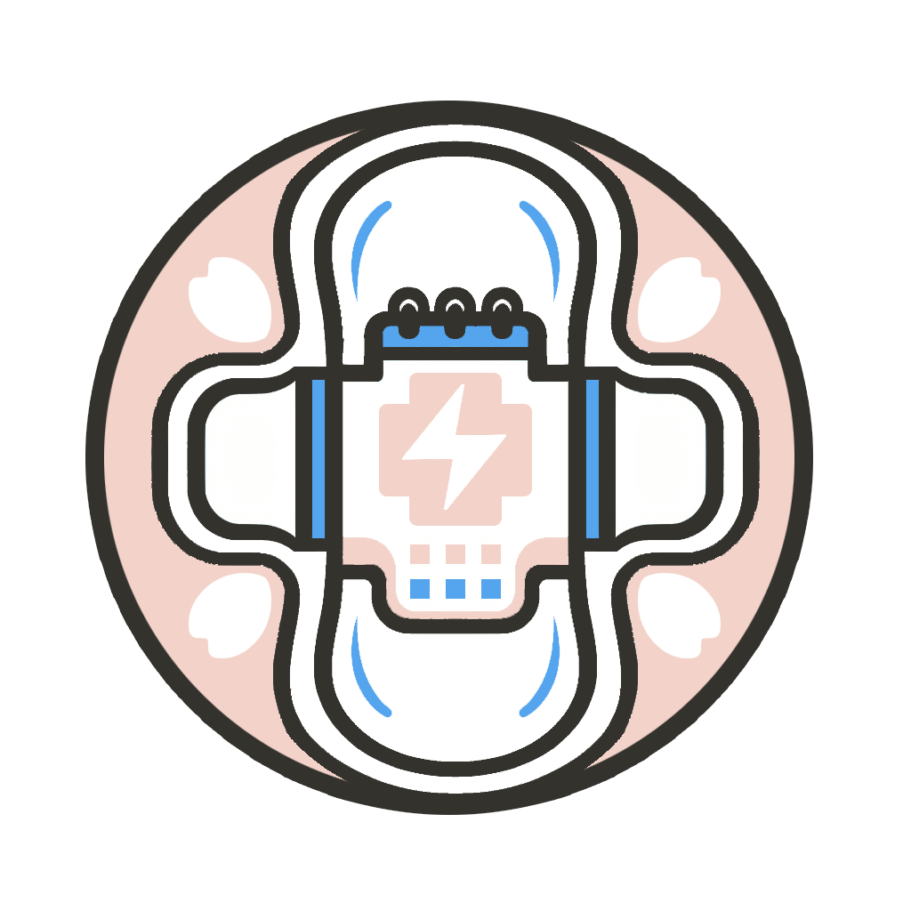

<div align="center">
 <h1><br/>FreePeriod</h1>
</div>
<br/>

<div align="center">

[](https://nextjs.org/)
[](https://www.typescriptlang.org/)
[](https://reactjs.org/)
[](https://tailwindcss.com/)
[](LICENSE)

A modern web platform for sustainable menstrual care solutions, built with Next.js and React.

</div>


## 🌟 Features

- 🌍 **Multilingual Support**: English and Chinese language options
- 🎨 **Modern UI/UX**: Responsive design with dark mode support using shadcn/ui
- 📍 **Location Services**: Interactive map integration for finding nearby stations
- 📊 **Impact Tracking**: Real-time sustainability metrics and visualization
- 📱 **Progressive Web App**: Mobile-first, responsive design
- 🔒 **Authentication**: Secure user authentication system
- 📚 **Educational Resources**: Comprehensive learning materials

## 🚀 Tech Stack

- **Framework:** Next.js 14 with App Router
- **Language:** TypeScript
- **Styling:** Tailwind CSS
- **Components:** shadcn/ui
- **Animations:** Framer Motion
- **State Management:** Zustand
- **Maps Integration:** Google Maps API
- **Localization:** Custom i18n implementation

## 🛠️ Installation

1. Clone the repository:
```bash
git clone https://github.com/ChanMeng666/free-period-website.git
```

2. Install dependencies:
```bash
npm install
```

3. Set up environment variables:
```bash
cp .env.example .env.local
```

4. Run the development server:
```bash
npm run dev
```

Open [http://localhost:3000](http://localhost:3000) with your browser to see the result.

## 📖 Usage

The application consists of several key sections:

- **Products**: Showcase of sustainable menstrual care products
- **Locations**: Interactive map for finding nearby stations
- **Impact**: Visualization of environmental impact metrics
- **Education**: Resources and educational materials
- **Authentication**: User account management

## 🔑 Environment Variables

The following environment variables are required:

```env
NEXT_PUBLIC_GOOGLE_MAPS_API_KEY=your_google_maps_api_key
```

## 🤝 Contributing

Contributions are welcome! Please feel free to submit a Pull Request.

1. Fork the Project
2. Create your Feature Branch (`git checkout -b feature/AmazingFeature`)
3. Commit your Changes (`git commit -m 'Add some AmazingFeature'`)
4. Push to the Branch (`git push origin feature/AmazingFeature`)
5. Open a Pull Request

## 📝 License

This project is licensed under the [Apache-2.0 license](LICENSE) file for details.

## 🙏 Acknowledgments

- [Next.js](https://nextjs.org/)
- [shadcn/ui](https://ui.shadcn.com/)
- [Tailwind CSS](https://tailwindcss.com/)
- [Framer Motion](https://www.framer.com/motion/)

## 📫 Contact

**Chan Meng**

- LinkedIn: [chanmeng666](https://www.linkedin.com/in/chanmeng666/)
- GitHub: [ChanMeng666](https://github.com/ChanMeng666)
