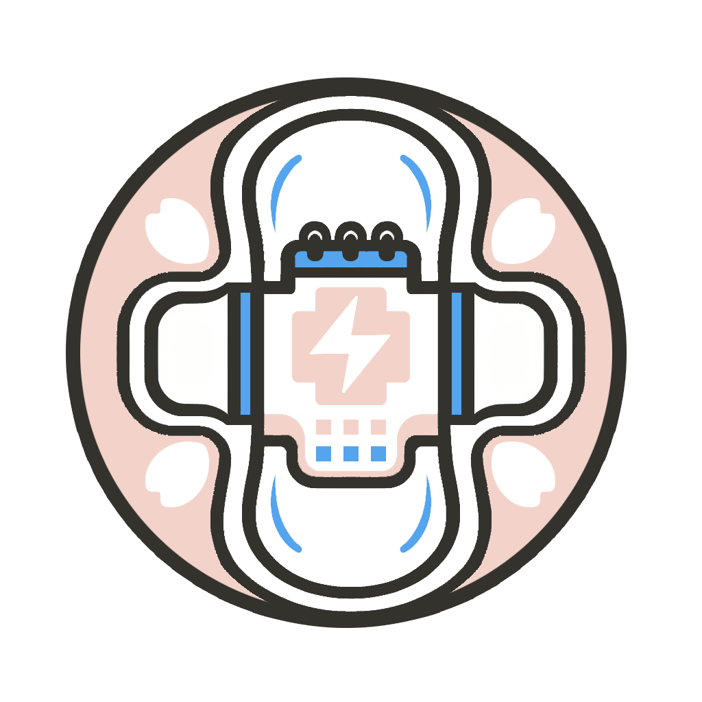
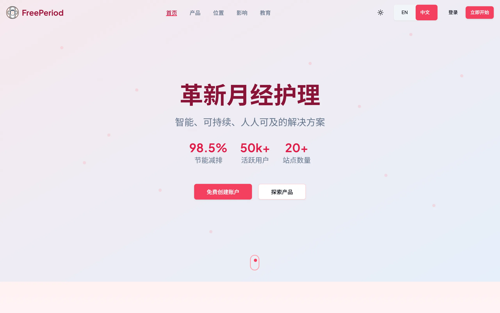
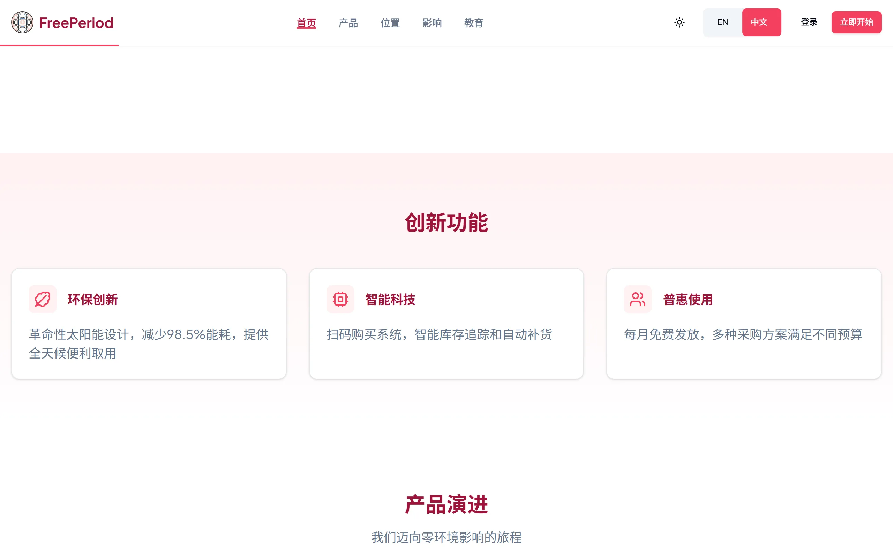
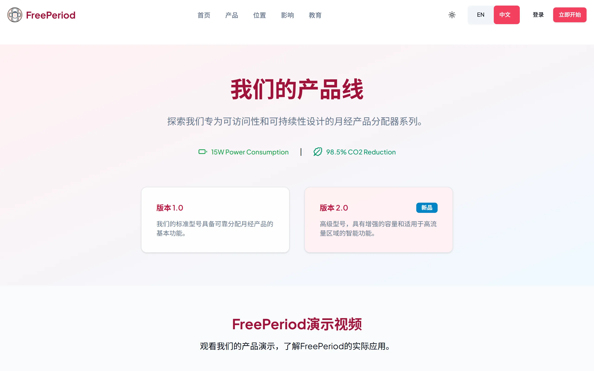
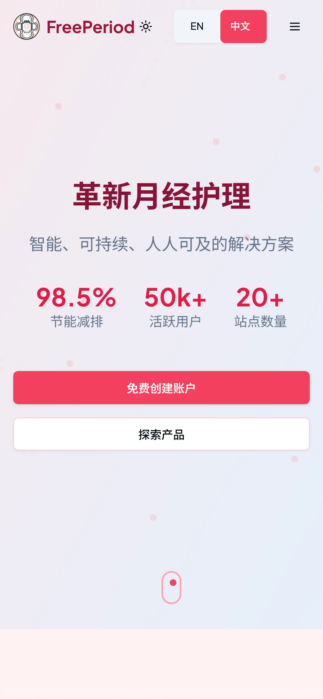
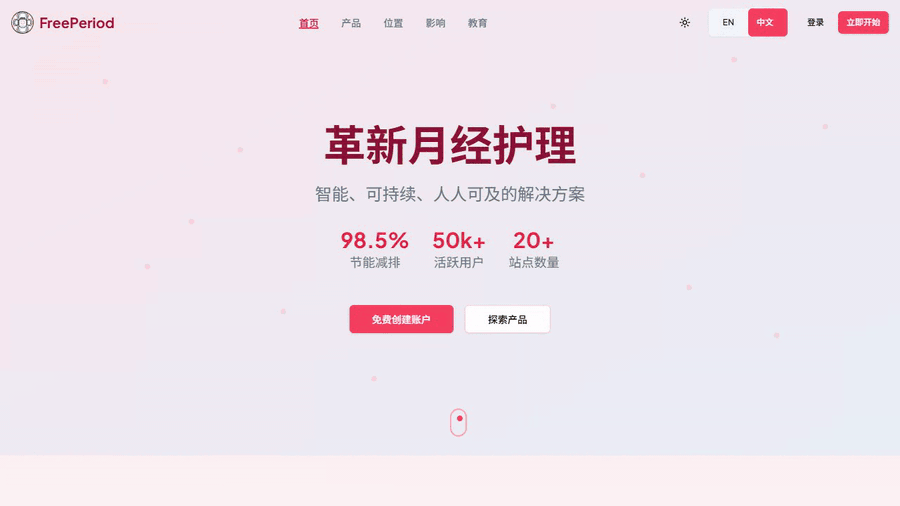
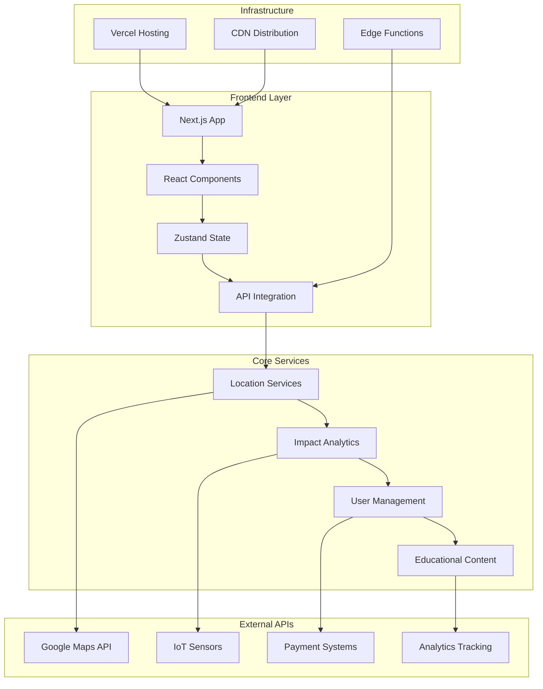

<div align="center"><a name="readme-top"></a>

[](#)

# 🌱 FreePeriod<br/><h3>Revolutionary Sustainable Menstrual Care Platform</h3>

An innovative web platform that leverages cutting-edge technology to provide sustainable menstrual care solutions.<br/>
Supports multilingual accessibility, smart dispensing technology, and extensible architecture with real-time impact tracking.<br/>
One-click **FREE** deployment of your sustainable care network.

[Live Demo][live-site] · [Documentation][docs] · [Impact Report][impact] · [Issues][github-issues-link]

<br/>

[][live-site]

<br/>

<!-- SHIELD GROUP -->

[![][github-stars-shield]][github-stars-link]
[![][github-forks-shield]][github-forks-link]
[![][github-issues-shield]][github-issues-link]
[![][github-license-shield]][github-license-link]
[![][cloudflare-shield]][cloudflare-link]

**Share FreePeriod Project**

[![][share-x-shield]][share-x-link]
[![][share-linkedin-shield]][share-linkedin-link]
[![][share-reddit-shield]][share-reddit-link]

<sup>🌟 Pioneering the future of sustainable menstrual care. Built for the next generation of accessibility and environmental responsibility.</sup>

<!-- SHOWCASE:START — generated by readme-showcase; edit docs/showcase/showcase.scenario.json and re-run instead of hand-editing -->
## Screenshots

| Desktop — Hero | Features | Products |
|:-:|:-:|:-:|
|  |  |  |

| Mobile |
|:-:|
|  |

### Demo


<!-- SHOWCASE:END -->

**Tech Stack Badges:**

<div align="center">

 
 
 
 
 
 

</div>

</div>

> [!IMPORTANT]
> This project demonstrates modern full-stack development practices with sustainability focus. It combines Next.js 14 with TypeScript to provide comprehensive menstrual care solutions. Features include smart dispensing technology, real-time impact tracking, multilingual support, and interactive location mapping.

<details>
<summary><kbd>📑 Table of Contents</kbd></summary>

#### TOC

- [🌱 FreePeriodRevolutionary Sustainable Menstrual Care Platform](#-freeperiodrevolutionary-sustainable-menstrual-care-platform)
  - [📸 Project Screenshots](#-project-screenshots)
  - [🎬 Demo Video](#-demo-video)
      - [TOC](#toc)
  - [🌟 Introduction](#-introduction)
  - [✨ Key Features](#-key-features)
    - [`1` Smart Dispensing Technology](#1-smart-dispensing-technology)
    - [`2` Environmental Impact Tracking](#2-environmental-impact-tracking)
    - [`*` Additional Features](#-additional-features)
  - [🛠️ Tech Stack](#️-tech-stack)
  - [🏗️ Architecture](#️-architecture)
    - [System Architecture](#system-architecture)
    - [Component Architecture](#component-architecture)
  - [⚡️ Performance](#️-performance)
  - [🚀 Getting Started](#-getting-started)
    - [Prerequisites](#prerequisites)
    - [Quick Installation](#quick-installation)
    - [Environment Setup](#environment-setup)
  - [🛳 Deployment](#-deployment)
    - [One-Click Deployment](#one-click-deployment)
  - [📖 Usage Guide](#-usage-guide)
    - [Basic Usage](#basic-usage)
    - [Core Features Navigation](#core-features-navigation)
    - [API Integration](#api-integration)
  - [🔌 Integrations](#-integrations)
  - [⌨️ Development](#️-development)
    - [Development Scripts](#development-scripts)
    - [Adding New Features](#adding-new-features)
  - [🤝 Contributing](#-contributing)
    - [Contribution Areas](#contribution-areas)
    - [Development Process](#development-process)
  - [📄 License](#-license)
  - [👥 Team](#-team)
  - [🙋‍♀️ Contact](#️-contact)

<br/>

</details>

## 🌟 Introduction

We are passionate developers creating next-generation sustainable menstrual care solutions. By adopting modern development practices and cutting-edge technologies, we aim to provide users and communities with powerful, accessible, and environmentally responsible tools.

Whether you're an end user seeking sustainable solutions or a developer interested in social impact technology, FreePeriod serves as your comprehensive platform for menstrual care innovation. Please note that this project is under active development, and we welcome feedback for any [issues][github-issues-link] encountered.

> [!NOTE]
> - Node.js >= 18.0 required
> - Google Maps API key required for location services
> - Modern browser with ES2020+ support
> - Internet connection for real-time features

| [![][demo-shield-badge]][live-site]   | No installation required! Visit our live demo to experience it firsthand.                           |
| :------------------------------------ | :--------------------------------------------------------------------------------------------- |

> [!TIP]
> **⭐ Star us** to receive all release notifications from GitHub without delay!

## ✨ Key Features

### `1` Smart Dispensing Technology

Experience next-generation menstrual care dispensing with our revolutionary smart technology. Our innovative approach provides unprecedented accessibility through advanced IoT integration and sustainable design. This breakthrough feature delivers 98.5% reduction in energy consumption while maintaining 24/7 availability.

<div align="center">
  
  <p><em>FreePeriod Smart Dispensers - Version 1.0 and 2.0 Evolution</em></p>
</div>

Key capabilities include:
- ⚡ **Ultra-Low Power**: 15W consumption vs 1000W traditional machines
- 📱 **Scan-to-Purchase**: QR code enabled mobile payment system
- 🌱 **Solar-Powered**: Sustainable energy with backup systems
- 📊 **Smart Inventory**: Real-time tracking and automated refills

[![][back-to-top]](#readme-top)

### `2` Environmental Impact Tracking

Revolutionary real-time impact visualization that transforms how users understand environmental benefits. With our advanced analytics and intuitive dashboard, users can track sustainability metrics while maintaining transparency in environmental contributions.

<div align="center">
  
  <p><em>Real-time Environmental Impact Analytics</em></p>
</div>

**Impact Metrics:**
- **Energy Reduction**: 98.5% less power consumption
- **Carbon Emissions**: 27.2 vs 1,814 kgCO2e/year
- **User Growth**: 50,000+ active users across Guangdong
- **Network Expansion**: 20+ strategic locations deployed

[![][back-to-top]](#readme-top)

### `*` Additional Features

Beyond the core sustainability features, FreePeriod includes:

- [x] 🌐 **Multilingual Platform**: Full English and Chinese support with i18n
- [x] 🗺️ **Interactive Mapping**: Google Maps integration for location discovery
- [x] 🔐 **Secure Authentication**: Comprehensive user account management
- [x] 📚 **Educational Hub**: Resources and learning materials
- [x] 📱 **Mobile-First Design**: Responsive PWA with native-like experience
- [x] 🎨 **Modern UI/UX**: Beautiful design with shadcn/ui components
- [x] 📊 **Real-time Data**: Live updates and synchronization
- [x] ♿ **Accessibility Ready**: WCAG compliant with screen reader support

> ✨ More features are continuously being added as we expand our impact.

<div align="right">

[![][back-to-top]](#readme-top)

</div>

## 🛠️ Tech Stack

<div align="center">
  <table>
    <tr>
      <td align="center" width="96">
        
        <br>Next.js 14
      </td>
      <td align="center" width="96">
        
        <br>React 18
      </td>
      <td align="center" width="96">
        
        <br>TypeScript 5
      </td>
      <td align="center" width="96">
        
        <br>Tailwind CSS
      </td>
      <td align="center" width="96">
        
        <br>Framer Motion
      </td>
      <td align="center" width="96">
        
        <br>Google Maps
      </td>
    </tr>
  </table>
</div>

**Frontend Stack:**
- **Framework**: Next.js 14 with App Router
- **Language**: TypeScript for comprehensive type safety
- **Styling**: Tailwind CSS + Framer Motion animations
- **State**: Zustand for efficient state management
- **UI Components**: Radix UI + shadcn/ui design system

**Core Libraries:**
- **Maps**: Google Maps API with React integration
- **Icons**: Lucide React icon library
- **Charts**: Recharts for data visualization
- **Authentication**: Custom auth implementation
- **Internationalization**: Custom i18n solution

**DevOps & Deployment:**
- **Deployment**: Vercel with automatic CI/CD
- **Package Manager**: npm with lock file optimization
- **Code Quality**: ESLint + Prettier
- **Version Control**: Git with conventional commits

> [!TIP]
> Each technology was carefully selected for production readiness, accessibility compliance, and long-term sustainability focus.

## 🏗️ Architecture

### System Architecture

> [!TIP]
> This architecture supports real-time data synchronization and sustainable infrastructure patterns, making it production-ready for social impact applications.


```mermaid
graph TB
    subgraph "Frontend Layer"
        A[Next.js App] --> B[React Components]
        B --> C[Zustand State]
        C --> D[API Integration]
    end
    
    subgraph "Core Services"
        E[Location Services] --> F[Impact Analytics]
        F --> G[User Management]
        G --> H[Educational Content]
    end
    
    subgraph "External APIs"
        I[Google Maps API]
        J[IoT Sensors]
        K[Payment Systems]
        L[Analytics Tracking]
    end
    
    D --> E
    E --> I
    F --> J
    G --> K
    H --> L
    
    subgraph "Infrastructure"
        M[Vercel Hosting]
        N[CDN Distribution]
        O[Edge Functions]
    end
    
    M --> A
    N --> A
    O --> D
```

### Component Architecture

```
src/
├── app/                    # Next.js App Router
│   ├── (auth)/            # Authentication routes
│   ├── products/          # Product showcase pages
│   ├── locations/         # Interactive mapping
│   ├── impact/            # Analytics dashboard
│   └── education/         # Learning resources
├── components/            # Reusable UI components
│   ├── ui/               # Base design system
│   ├── layout/           # Page layout components
│   ├── product/          # Product-specific components
│   ├── impact/           # Impact tracking components
│   └── navigation/       # Navigation components
├── lib/                  # Core utilities
│   ├── translations/     # i18n implementation
│   ├── translate.ts      # Translation utilities
│   └── utils.ts          # Helper functions
├── contexts/             # React contexts
│   ├── LanguageContext.tsx
│   └── ThemeContext.tsx
└── types/               # TypeScript definitions
    ├── product.ts
    ├── location.ts
    └── navigation.ts
```

## ⚡️ Performance

**Key Performance Metrics:**
- 🚀 **Fast Loading**: Optimized for mobile-first performance
- 💨 **Efficient Rendering**: React 18 concurrent features
- 📊 **Real-time Updates**: Smooth data synchronization
- 🔄 **Caching Strategy**: Smart asset and API caching
- 📱 **Mobile Optimized**: Progressive Web App capabilities

**Optimization Features:**
- 🎯 **Code Splitting**: Automatic route-based splitting
- 🖼️ **Image Optimization**: Next.js Image component with WebP
- 🗺️ **Map Performance**: Efficient Google Maps integration
- 🌐 **i18n Efficiency**: Optimized translation loading

## 🚀 Getting Started

### Prerequisites

> [!IMPORTANT]
> Ensure you have the following installed:

- Node.js 18.0+ ([Download](https://nodejs.org/))
- npm package manager (included with Node.js)
- Git ([Download](https://git-scm.com/))
- Google Maps API key ([Get API Key](https://developers.google.com/maps/documentation/javascript/get-api-key))

### Quick Installation

**1. Clone Repository**

```bash
git clone https://github.com/ChanMeng666/free-period-website.git
cd free-period-website
```

**2. Install Dependencies**

```bash
npm install
```

**3. Environment Setup**

```bash
# Copy environment template
cp .env.example .env.local

# Add your Google Maps API key
echo "NEXT_PUBLIC_GOOGLE_MAPS_API_KEY=your_api_key_here" >> .env.local
```

**4. Start Development**

```bash
npm run dev
```

🎉 **Success!** Open [http://localhost:3000](http://localhost:3000) to view FreePeriod.

### Environment Setup

Create `.env.local` file with the following variables:

```bash
# Required: Google Maps Integration
NEXT_PUBLIC_GOOGLE_MAPS_API_KEY="your-google-maps-api-key"

# Optional: Analytics & Monitoring
NEXT_PUBLIC_ANALYTICS_ID="your-analytics-id"
```

> [!TIP]
> Get your Google Maps API key from the [Google Cloud Console](https://console.cloud.google.com/) and enable the Maps JavaScript API.

## 🛳 Deployment

### One-Click Deployment

**Cloudflare Pages (Recommended)**

**Manual Deployment:**

```bash
# Install dependencies
npm install

# Build static export
npm run build

# Deploy to Cloudflare Pages
npm run deploy
```

**Environment Variables for Production:**
- Add `NEXT_PUBLIC_GOOGLE_MAPS_API_KEY` in your deployment platform
- Configure any additional analytics or monitoring keys

## 📖 Usage Guide

### Basic Usage

**Getting Started:**

1. **Explore Products** to learn about sustainable dispensing technology
2. **View Locations** on the interactive map to find nearby stations
3. **Track Impact** through real-time environmental metrics
4. **Access Education** resources for comprehensive learning

### Core Features Navigation

- **🏠 Home**: Platform overview with key metrics
- **📦 Products**: FreePeriod dispenser evolution (V1.0 & V2.0)
- **📍 Locations**: Interactive map with 20+ stations across Guangdong
- **📊 Impact**: Real-time sustainability analytics
- **📚 Education**: Learning resources and guides

### API Integration

**Location Data:**

```javascript
// Get active dispenser locations
const locations = await fetch('/api/locations');
const data = await locations.json();

// Example response
{
  "locations": [
    {
      "id": "1",
      "name": "香港科技大学",
      "status": "active",
      "availableUnits": 99,
      "position": {
        "lat": 22.886614568666317,
        "lng": 113.47847276675165
      }
    }
  ]
}
```

## 🔌 Integrations

Current platform integrations:

| Service | Purpose | Status | Documentation |
|---------|---------|--------|---------------|
| **Google Maps** | Location Services | ✅ Active | [Setup Guide](docs/google-maps.md) |
| **Framer Motion** | Animations | ✅ Active | [Animation Guide](docs/animations.md) |
| **Vercel Analytics** | Performance Tracking | ✅ Active | [Analytics Setup](docs/analytics.md) |
| **shadcn/ui** | Component Library | ✅ Active | [UI Components](docs/components.md) |

## ⌨️ Development

### Development Scripts

```bash
# Development
npm run dev          # Start development server
npm run build        # Production build
npm run start        # Start production server
npm run lint         # Run ESLint

# Code Quality
npm run type-check   # TypeScript validation
npm run format       # Prettier formatting
```

### Adding New Features

**1. Feature Structure:**

```
src/
├── app/new-feature/          # Route pages
├── components/new-feature/   # Feature components
├── lib/new-feature/          # Business logic
└── types/new-feature.ts      # Type definitions
```

**2. Development Guidelines:**

- ✅ Follow TypeScript best practices
- ✅ Add proper internationalization
- ✅ Include accessibility features
- ✅ Add environmental impact considerations
- ✅ Test on mobile devices

## 🤝 Contributing

We welcome contributions to FreePeriod! Here's how you can help advance sustainable menstrual care technology:

### Contribution Areas

- 🌱 **Sustainability Features**: Enhance environmental impact tracking
- 🗺️ **Location Services**: Improve mapping and accessibility
- 🌐 **Internationalization**: Add new language support
- 📚 **Educational Content**: Develop learning resources
- ♿ **Accessibility**: Improve inclusive design
- 📱 **Mobile Experience**: Enhance responsive design

### Development Process

1. **Fork & Clone** the repository
2. **Create Branch**: `git checkout -b feature/sustainability-enhancement`
3. **Develop**: Follow our coding standards and accessibility guidelines
4. **Test**: Ensure mobile compatibility and performance
5. **Submit PR**: Include impact description and screenshots

[![][pr-welcome-shield]][pr-welcome-link]

<a href="https://github.com/ChanMeng666/free-period-website/graphs/contributors" target="_blank">
  
</a>

## 📄 License

This project is licensed under the MIT License - see the [LICENSE](LICENSE) file for details.

**Open Source Benefits:**
- ✅ Commercial use allowed for sustainable initiatives
- ✅ Modification allowed for accessibility improvements
- ✅ Distribution allowed for social impact projects
- ✅ Private use allowed with attribution

## 👥 Team

<div align="center">
  <table>
    <tr>
      <td align="center">
        <a href="https://github.com/ChanMeng666">
          
          <br />
          <sub><b>Chan Meng</b></sub>
        </a>
        <br />
        <small>Creator & Lead Developer</small>
        <br />
        <small>Sustainability Tech Advocate</small>
      </td>
    </tr>
  </table>
</div>

## 🙋‍♀️ Contact

**Chan Meng**
-  LinkedIn: [chanmeng666](https://www.linkedin.com/in/chanmeng666/)
-  GitHub: [ChanMeng666](https://github.com/ChanMeng666)
-  Email: chanmeng.dev@gmail.com
-  Portfolio: [chanmeng.org](https://chanmeng.org/)

---

<div align="center">
<strong>🌱 Building the Future of Sustainable Menstrual Care 🌟</strong>
<br/>
<em>Empowering communities through accessible, environmentally responsible solutions</em>
<br/><br/>

⭐ **Star us on GitHub** • 🌍 **Try Live Demo** • 📊 **View Impact** • 🤝 **Contribute to Sustainability**

<br/><br/>

**Made with ❤️ and 🌱 for a sustainable future**


</div>

---

<!-- LINK DEFINITIONS -->

[back-to-top]: https://img.shields.io/badge/-BACK_TO_TOP-151515?style=flat-square

<!-- Project Links -->
[live-site]: https://free-period-website.pages.dev/
[docs]: https://free-period-website.pages.dev/education
[impact]: https://free-period-website.pages.dev/impact

<!-- GitHub Links -->
[github-issues-link]: https://github.com/ChanMeng666/free-period-website/issues
[github-stars-link]: https://github.com/ChanMeng666/free-period-website/stargazers
[github-forks-link]: https://github.com/ChanMeng666/free-period-website/forks
[pr-welcome-link]: https://github.com/ChanMeng666/free-period-website/pulls
[github-license-link]: https://github.com/ChanMeng666/free-period-website/blob/main/LICENSE

<!-- Deployment Links -->
[cloudflare-link]: https://free-period-website.pages.dev/

<!-- Shield Badges -->
[github-stars-shield]: https://img.shields.io/github/stars/ChanMeng666/free-period-website?color=ffcb47&labelColor=black&style=flat-square
[github-forks-shield]: https://img.shields.io/github/forks/ChanMeng666/free-period-website?color=8ae8ff&labelColor=black&style=flat-square
[github-issues-shield]: https://img.shields.io/github/issues/ChanMeng666/free-period-website?color=ff80eb&labelColor=black&style=flat-square
[github-license-shield]: https://img.shields.io/badge/license-MIT-white?labelColor=black&style=flat-square
[cloudflare-shield]: https://img.shields.io/badge/cloudflare-online-55b467?labelColor=black&logo=cloudflare&style=flat-square
[pr-welcome-shield]: https://img.shields.io/badge/🤝_PRs_welcome-%E2%86%92-ffcb47?labelColor=black&style=for-the-badge

<!-- Badge Variants -->
[demo-shield-badge]: https://img.shields.io/badge/TRY%20LIVE%20DEMO-ONLINE-55b467?labelColor=black&logo=cloudflare&style=for-the-badge

<!-- Social Share Links -->
[share-x-link]: https://x.com/intent/tweet?hashtags=sustainability,opensource,menstrualhealth&text=Check%20out%20FreePeriod%20-%20Revolutionary%20Sustainable%20Menstrual%20Care%20Platform&url=https%3A%2F%2Fgithub.com%2FChanMeng666%2Ffree-period-website
[share-linkedin-link]: https://linkedin.com/sharing/share-offsite/?url=https://github.com/ChanMeng666/free-period-website
[share-reddit-link]: https://www.reddit.com/submit?title=FreePeriod%20-%20Sustainable%20Menstrual%20Care%20Platform&url=https%3A%2F%2Fgithub.com%2FChanMeng666%2Ffree-period-website

[share-x-shield]: https://img.shields.io/badge/-share%20on%20x-black?labelColor=black&logo=x&logoColor=white&style=flat-square
[share-linkedin-shield]: https://img.shields.io/badge/-share%20on%20linkedin-black?labelColor=black&logo=linkedin&logoColor=white&style=flat-square
[share-reddit-shield]: https://img.shields.io/badge/-share%20on%20reddit-black?labelColor=black&logo=reddit&logoColor=white&style=flat-square
</rewritten_file>

---

<!-- CHAN MENG PERSONAL BRAND -->
<div align="center">
  <a href="https://github.com/ChanMeng666" target="_blank">
    
  </a>

  <p><strong>Chan Meng</strong><br/>Need a custom app like this one? I build them — let's talk.</p>

  <a href="mailto:chanmeng.dev@gmail.com"></a>
  <a href="https://github.com/ChanMeng666"></a>
</div>
<!-- /CHAN MENG PERSONAL BRAND -->
